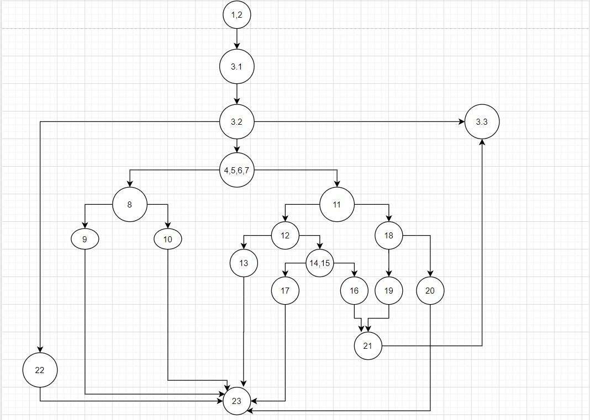
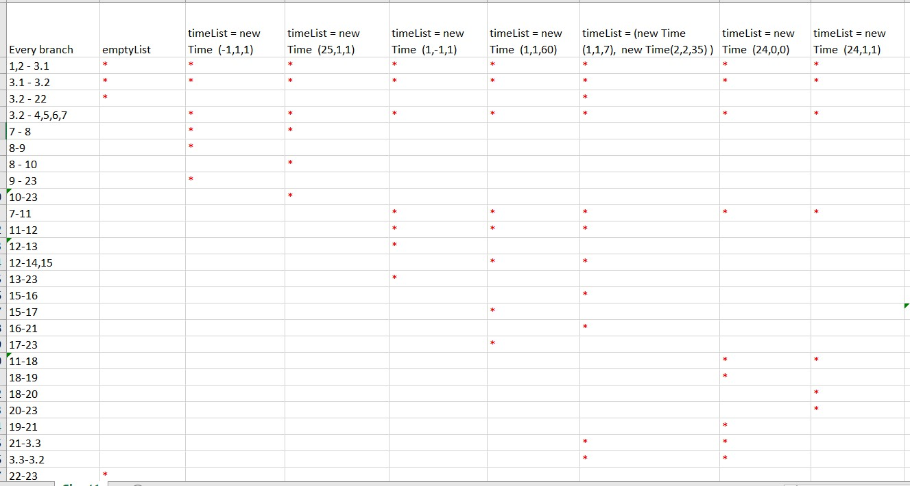

# Втора лабораториска вежба по Софтверско инженерство
## Наталија Читинска, 193037

### Control Flow Graph

### Цикломатска комплексност  
Цикломатската комплексност на овој код изнесува 8.  
Истата е добиена според формулата која го вклучува бројот на предикатни јазли P+1. Во овој случај бројот на предикатни 
јазли (P) е еднаков на 7, па оттука 7+1=8.

### Тест случаи според Multiple Condition критериумот
1. if (hr < 0 || hr > 24)
   - T || X -> SILab2.function(createList(new Time(-1,1,1))) 
   - F || T -> SILab2.function(createList(new Time(25,1,1)))
   - F || F -> SILab2.function(createList(new Time(1,1,1)))
2. if (min < 0 || min > 59)
   - T || X -> SILab2.function(createList(new Time(1,-1,1)))
   - F || T -> SILab2.function(createList(new Time(25,60,1)))
   - F || F -> SILab2.function(createList(new Time(1,1,1)))
3. if (sec >= 0 && sec <= 59)
   - T && T -> SILab2.function(createList(new Time(1,1,7))) 
   - T && F -> SILab2.function(createList(new Time(1,1,60)))
   - F && X -> SILab2.function(createList(new Time(1,1,-1)))
4. else if (hr == 24 && min == 0 && sec == 0)
   - T && T && T -> SILab2.function(createList(new Time(24,0,0)))
   - T && T && F -> SILab2.function(createList(new Time(24,0,3)))
   - T && F && X -> SILab2.function(createList(new Time(24,3,3)))
   - F && X && X 
### Тест случаи според Every branch критериумот

### Објаснување на напишаните unit тестови
1. **Multiple condition** 

    Во овој код има 4 услови кои содржат логички изрази.  
    1. За првиот услов или if (hr < 0 || hr > 24), помеѓу двата изрази има знак за дисјункција, односно доволно е еден израз 
    да биде точен за целиот услов да е точен. Затоа овде се разгледуваат три случаи:  
       1. Првиот случај T || X, значи дека првиот израз е точен, па вториот израз може да биде било што(точен/неточен). Тоа ќе 
    се постигне доколку на часот се додели вредност помала од 0.
       2. Вториот случај би бил F || T, односно доколу првиот израз е неточен, продолжуваме со разгледување на вториот случај, кој
       доколку е точен, целиот услов ќе биде исполнет. Тоа ќе се постигне доколку на часот се додели вредност поголема од 24.
       3. Третиот случај е кога и двата изрази се невистинити одосно, па со тоа условот не е исполнет. За тоа да се постигне потребно е 
       да се додели вредност за часот која ќе биде поголема од нула, а помала од 24.
    2. Вториот таков услов ги содржи минутите if (min < 0 || min > 59). Овде важи истото како и погоре наведенето за првиот услов, односно
    дека условот би бил исполнет доколку барем еден од изразите е вистинит. Разликата е во вредноста која се доделува на минутите.
       1. За првиот израз да биде исполнет, вредноста за минутите треба да биде помала од 0. (негативна)
       2. За вториот израз да е точен, вредноста треба да биде поголема од 59
       3. И двата изрази да се неточни, односно за условот да не е исполнет, минутите треба да бидат во опсег од 0 до 59.
    3. Во третиот услов, кога се работи се секундите има исто така два изрази, но овојпат меѓу нив има знак за конјункција, што значи
    дека за условот да се смета за исполнет, потребно е и двата услови да бидат исполнети.
       1. Т \&\& T значи дека ако првиот израз е точен тогаш потребно е да ја провериме точноста и на вториот израз. Со тоа условот е задоволен,
       а тоа се постигнува доколку на секундите се прати вредност која е во опсегот [0-59].
       2. Т \&\& F значи дека иако првиот е израз е точен, сепак вториот израз би можел да биде неточен. Во овој случај тоа би се постигнало,
       доколку секундите го надминуваат опсегот [0-59], односно имаат вреност поголема од 59. Со тоа целиот услов е  неточен.
       3. Случајот кога првиот израз е неточен при конјункција е случај кога веднаш се застанува со проверка и условот се смета за неточен, поради што
       не е важно која е вистинитоста не вториот израз. Доколку секудните имаат вреност која е помала од 0, исполнет е овој случај.
    4. Последниот услов од ваков тип е else if (hr == 24 && min == 0 && sec == 0), којшто содржи три изрази кои треба да бидат точни за условот да биде исполнет.
       1. Т \&\& T \&\& T - ако првиот израз е точен, продолжуваме со проверка на вториот и доколку и тој е точен се продолжува со проверка на третиот израз. Сите
       изрази се точни кога часот=24, минути=0 и секунди=0
       2. Т \&\& T \&\& F - во овој случај постапката е иста како и во претходниот, но овојпат последниот израз е неточен, па и целиот услов е неточен. Односно
       часот=24, минути=0 и секундите имаат вредност различна од 0
       3. Т \&\& F \&\& X - првиот израз е точен, што значи продолжуваме понатаму, но вториот случај ако е негативен застануваме и не е важна точноста на третиот израз.
       Тоа е случај кога часот=24, минутите!=0 и секундите може да ја добијат било која целобројна вредност.
       4. F \&\& X \&\& X - последниот случај, во којшто уште на почетокот има неточност на првиот израз и воопшто не продолжуваме да ги разгледуваме следните изрази, бидејќи 
       тоа не би влијаело на точноста на условот. Доколку овој услов не е исполнет, според напишаниот код би требало да се фрли исклучок со порака 
       "The time is greater than the maximum", но доколку на часот се даде вредност различна од 24 (поголема од 24, помала од24 дури и помала од 0), таквите тест случаи веќе се 
       опфатени во кодот погоре, што значи дека воопшто нема да стигне до овој дел. Имено, не е можно да се напише тест случај.
2. **Every branch**  
Целта на ова тестирање е да се поминат сите можни гранки коишто постојат во Control Flow Graph-от. Искористени се истите тестови од Multiple Condition тестирањето, со додавање на
тест каде што функцијата прима празна листа, па со тоа иако ќе влезе во for циклусот и бројачот ќе биде иницијализиран сепак нема да ја помине успешно проверката дека овој бројач е 
помал од големината на листата, бидејќи истата ќе биде 0. Затоа овде завршува функцијата, што не е случај во остнататите тестови кога листата не е празна, па според доделените вредности
поминува преку повеќе гранки.  
List<Integer> emptyList = new ArrayList<>() // празна листа  
assertEquals(result,SILab2.function(Collections.emptyList())) // се споредува, празната листа emptyList, со вредноста која ќе ја врати функцијата кога се повикува со празна листа  
Двете вредности се празни листи, односно се еднкави со што овој тест успешно поминува.  
Во втората слика прикажана погоре, онаму каде што има ѕвездичка(*), значи дека соодветната гранка е помината доколку како аргумент на функцијата се прати листа со соодветни вредности.  
Всушност листата се состои од објекти од класата Time, при што секој објект прима целобројна вредност за час, минути и секунди.  
Онаму каде што се очекува исклучок, се споредуваат пораките на исклучокот (5 случаеви) и ова се постигнува со методот assertThrows().   
Онаму каде што се валидни вредностите за час, минути и секунди и соодветно се претворени во секунди, се споредува со очекуваниот резултат според тие вредности. Се користи методот assertEquals().  
Дополнителен тест случај е случајот којшто во Multiple Condition критериумот не беше возможен, а тоа е случајот кога кодот ќе стигне до else делот и ќе се испечати порака
"The time is greater than the maximum". За да стигне до овде, вредностите за час, минути и секунди на пример би можеле да бидат: (24,1,1). assertTrue(ex.getMessage().contains("The time is greater than the maximum"));

